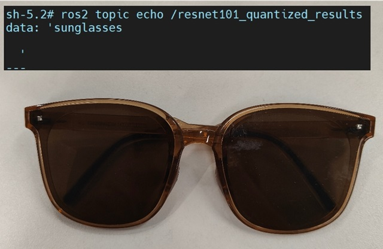

# AI Samples Resnet101 Quantized

## Overview

ResNet101 is a machine learning model that can classify images from the Imagenet dataset. It can also be used as a backbone in building more complex models for specific use cases.

`sample_resnet101 quantized` is a Python-based classify images ROS node that uses QNN for model inference. 

For more information, please refer to  https://github.com/qualcomm-qrb-ros/qrb_ros_samples/tree/main/ai_vision/sample_resnet101_quantized)



## Pipeline flow for Resnet101 Quantized


## ROS Nodes Used in Resnet101 Quantized

| ROS Node                | Description                                                  |
| ----------------------- | ------------------------------------------------------------ |
| `qrb_ros_resnet101 `    | qrb_ros_resnet101 is a python-based ros jazzy packages realize classify images,  uses QNN htp as model backend. receive image topic , publish classify result topic. |
| `image_publisher_node ` | image_publisher is  a ros jazzy packages, can publish image ros topic with local path. source link:[ros-perception/image_pipeline: An image processing pipeline for ROS.](https://github.com/ros-perception/image_pipeline) |

## ROS Topics Used in Resnet101 Quantized

| ROS Topic                      | Type                         | Published By            |
| ------------------------------ | ---------------------------- | ----------------------- |
| `resnet101_quantized_results ` | `< sensor_msgs.msg.String> ` | `qrb_ros_resnet101`     |
| `image_raw `                   | `< sensor_msgs.msg.Image> `  | `image_publisher_node ` |

## Use cases on QCLINUX

### Prerequisites
- `SSH` is enabled in 'Permissive' mode with the steps mentioned in [Log in using SSH](https://docs.qualcomm.com/bundle/publicresource/topics/80-70017-254/how_to.html?vproduct=1601111740013072&latest=true#use-ssh).

- Download Robotics image and QIRP SDK from [QC artifacts](https://artifacts.codelinaro.org/ui/native/qli-ci/flashable-binaries/qirpsdk/) or Generate Robotics image and QIRP SDK with [meta-qcom-robotics-sdk/README.md](https://github.com/qualcomm-linux/meta-qcom-robotics-sdk)

- The prebuilt robotics image is flashed, see [Flash image](https://docs.qualcomm.com/bundle/publicresource/topics/80-70017-254/flash_images.html?vproduct=1601111740013072&latest=true)

### On Host
On the host machine, move to the artifacts directory and decompress the package using the `tar` command.

1. Build projects

```bash
#source qirp sdk env
tar -zxf qirp-sdk_<qirp_version>.tar.gz
cd <qirp_decompressed_path>/qirp-sdk
source setup.sh 

#build Samples
cd <qirp_decompressed_path>/qirp-sdk/qirp_samples/ai_vision/sample_resnet101_quantized
colcon build
```

2. Install Packages

```bash
cd <qirp_decompressed_workspace>/qirp-sdk/qirp_samples/ai_vision/sample_resnet101_quantized/
scp -r install/sample_resnet101_quantized/* root@10.92.129.14:/usr
```


### On Device

```bash
(ssh) /usr/share/qirp-setup.sh
(ssh) ros2 launch sample_resnet101_quantized  launch_with_image_publisher.py
 or
(ssh) ros2 launch sample_resnet101_quantized  launch_with_image_publisher.py image_path:=/usr/share/sample_resnet101_quantized/cup.jpg
```

